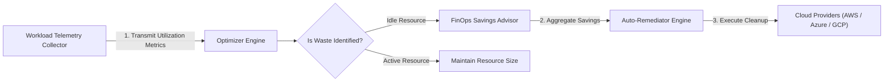

<div align="center">


# cloud-cost-optimizer

### Automated Multi-Cloud Rightsizing & Resource Remediation Engine in Golang

[](https://devopstrio.co.uk)
[](https://go.dev)
[](https://devopstrio.co.uk)

</div>

---

## ⚡ Technical Overview & Engine Scope

The **Cloud Cost Optimizer** is an automated multi-cloud rightsizing, idle resource cleanup, and cost remediation engine written in **pure Golang (Go v1.22+)**.

It analyzes workload CPU and memory telemetry, calculates potential monthly savings, and executes policy-driven dry-run or live auto-remediations.


---

## 🔄 Cost Remediation Sequence Flow



---

## 📂 Repository Directory Layout

```
cloud-cost-optimizer/
├── .github/
│   └── workflows/
│       └── optimizer-ci.yml     # Go 1.22 CI test pipeline
├── docs/
│   ├── ARCHITECTURE.md          # Architectural specification document
│   ├── deployment-guide.md      # Deployment manual
│   └── images/
│       └── architecture_diagram.jpg # Visual blueprint diagram
├── internal/
│   ├── optimizer/
│   │   ├── engine.go            # Resource rightsizing engine
│   │   └── engine_test.go       # Engine unit tests
│   ├── recommendation/
│   │   ├── advisor.go           # FinOps savings advisor
│   │   └── advisor_test.go      # Advisor unit tests
│   └── remediation/
│       ├── auto_remediator.go   # Automated remediation module
│       └── auto_remediator_test.go # Remediator unit tests
├── main.go                      # Go CLI server entrypoint
├── main_test.go                 # Integration test suite
├── go.mod                       # Go module manifest
├── .gitignore                   # Git ignore file
└── README.md                    # Engine documentation
```

---

## 🚀 Quick Start Guide

### 1. Build Go Server Binary

```bash
# Clone repository
git clone https://github.com/Devopstrio/cloud-cost-optimizer.git
cd cloud-cost-optimizer

# Build server binary
go build -o optimizer-server main.go
```

### 2. Execute Optimizer Engine

```bash
./optimizer-server
```

### 3. Run Native Go Test Suite

```bash
go test -v ./...
```

<div align="center">

<sub>&copy; 2026 Devopstrio &mdash; Engineering Uninterrupted Global Workforce Productivity.</sub>

</div>
