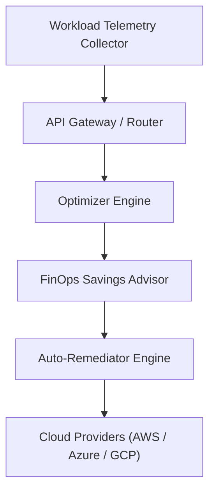

<div align="center">


# cloud-cost-optimizer

### Automated Multi-Cloud Rightsizing & Resource Remediation Engine in Golang

[](https://devopstrio.co.uk)
[](https://go.dev)
[](https://devopstrio.co.uk)
[](https://opentofu.org)

</div>

---

## Overview

The **Cloud Cost Optimizer** accelerator provides a high-performance Golang engine and cloud platform infrastructure for automated multi-cloud workload rightsizing, idle resource identification, and policy-driven remediation.

## Executive Summary

As enterprise organizations scale cloud infrastructure across AWS, Azure, and GCP, unmonitored compute waste and idle virtual machine instances inflate monthly spending. 

This repository delivers an end-to-end Go 1.22+ engine (`internal/`), OpenTofu IaC modules (`terraform/`), and Kubernetes deployment overlays (`deployment/kubernetes/`) engineered to enterprise standards comparable to repositories maintained by Microsoft Azure, AWS Samples, and HashiCorp reference architectures.

## Architecture


### High-Level Execution Sequence



## Core Capabilities

- **Golang Rightsizing Engine**: High-throughput utilization evaluation (`internal/optimizer`) calculating monthly dollar savings for idle workloads.
- **FinOps Savings Advisor**: Aggregates potential cost savings across cloud environments into executive recommendations (`internal/recommendation`).
- **Policy-Driven Remediator**: Executes dry-run or live auto-remediation policies (`internal/remediation`) to clean up unutilized compute resources.
- **Multi-Cloud IaC Automation**: OpenTofu and Terraform modules for VPC, IAM, ECS, and CloudWatch metric alarms.
- **Kubernetes Production Overlays**: Kustomize environment overlays (`dev`, `test`, `prod`) for declarative GitOps deployment.

## Repository Structure

```
cloud-cost-optimizer/
├── .github/              # CI/CD workflows, issue & PR templates, CODEOWNERS
├── architecture/         # Mermaid sequence flow diagrams
├── deployment/           # Kubernetes manifests & Kustomize environment overlays
├── docs/                 # Enterprise architectural, deployment, & operational guides
├── examples/             # Real-world request/response JSON payloads
├── images/               # High-resolution architecture & workflow diagrams
├── internal/             # Go source packages (optimizer, recommendation, remediation)
├── terraform/            # Multi-cloud OpenTofu / Terraform IaC modules
├── tests/                # Unit, integration, and API test suites
├── Dockerfile            # Container build specification
├── docker-compose.yml    # Multi-container local orchestration
├── main.go               # Go CLI server entrypoint
├── go.mod                # Go module manifest
└── README.md             # Accelerator documentation manual
```

## Technology Stack

- **Core Engine**: Golang 1.22+
- **Infrastructure as Code**: OpenTofu 1.8.5 / Terraform 1.6+
- **Container Orchestration**: Docker, Docker Compose, Kubernetes 1.28+
- **Testing & Quality**: Go Native Test Runner (`go test`), GitHub Actions CI

## Quick Start

```bash
# Clone repository
git clone https://github.com/Devopstrio/cloud-cost-optimizer.git
cd cloud-cost-optimizer

# Build Go server binary
go build -o optimizer-server main.go

# Run server binary
./optimizer-server

# Run test suite
go test -v ./...
```

## Docker

```bash
# Build and run cost optimizer container
docker build -t devopstrio/cloud-cost-optimizer:latest .
docker-compose up --build -d
```

## Terraform

```bash
cd terraform
tofu init
tofu plan
tofu apply -auto-approve
```

## Kubernetes

```bash
# Apply production overlay via Kustomize
kubectl apply -k deployment/kubernetes/overlays/prod/
```

## Documentation

- [`docs/Architecture.md`](docs/Architecture.md) &mdash; Detailed architectural design specifications
- [`docs/GettingStarted.md`](docs/GettingStarted.md) &mdash; Local setup and installation manual
- [`docs/ImplementationGuide.md`](docs/ImplementationGuide.md) &mdash; Custom Golang engine integration guide
- [`docs/DeploymentGuide.md`](docs/DeploymentGuide.md) &mdash; Multi-cloud Kubernetes & Terraform deployment
- [`docs/RepositoryGuide.md`](docs/RepositoryGuide.md) &mdash; Repository layout and module guide
- [`docs/Roadmap.md`](docs/Roadmap.md) &mdash; Future feature roadmap
- [`docs/FAQ.md`](docs/FAQ.md) &mdash; Frequently asked questions

## Examples

- [`examples/resource-rightsizing/`](examples/resource-rightsizing/) &mdash; Workload rightsizing evaluation payload
- [`examples/savings-advisor/`](examples/savings-advisor/) &mdash; FinOps savings aggregation payload
- [`examples/auto-remediation/`](examples/auto-remediation/) &mdash; Auto-remediation policy payload

## Testing

```bash
# Execute unit, integration, and API test suites
go test -v ./...
```

## Security

Refer to [`SECURITY.md`](SECURITY.md) for reporting security vulnerabilities and vulnerability handling protocols.

## Observability

The platform exports structured CloudWatch log groups (`/aws/finops/cloud-cost-optimizer`) and metric alarms for real-time idle workload monitoring.

## Multi-Cloud Strategy

Infrastructure blueprints support AWS ECS/VPC deployment with modular extensions for Azure Virtual Machines and Google Cloud Run environments.

## Roadmap

See [`docs/Roadmap.md`](docs/Roadmap.md) for upcoming milestones including live AWS Auto Scaling Group rightsizing adapters and OPA policy guardrails.

## Contributing

See [`CONTRIBUTING.md`](CONTRIBUTING.md) and [`CODE_OF_CONDUCT.md`](CODE_OF_CONDUCT.md) for contribution guidelines and community standards.

<div align="center">

<sub>&copy; 2026 Devopstrio &mdash; Engineering Uninterrupted Global Workforce Productivity.</sub>

</div>
