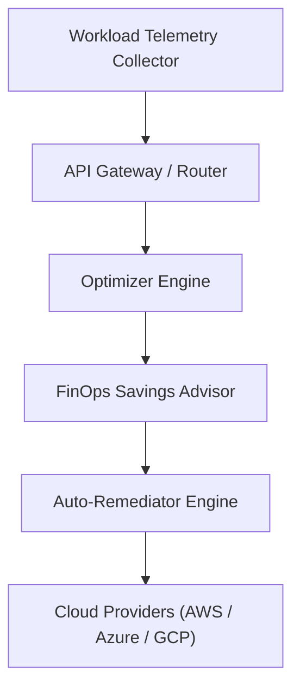

# Cloud Cost Optimizer Architecture

This document specifies the technical architecture and component design of the Cloud Cost Optimizer Engine.

## Core Architectural Layers

### 1. Workload Telemetry Collection
The telemetry pipeline ingests CPU utilization, memory consumption, and hourly pricing metrics across AWS EC2, Azure VMs, and GCP Compute Engine workloads.

### 2. Rightsizing & Optimization Engine
`OptimizerEngine` evaluates resource utilization metrics against configurable idle thresholds (default <5% CPU utilization). It calculates estimated monthly cost savings for idle workloads.

### 3. Savings Advisor & Auto-Remediator
`Advisor` aggregates total potential savings into executive FinOps reports. `AutoRemediator` executes policy-driven dry-run or live infrastructure cleanup actions.
