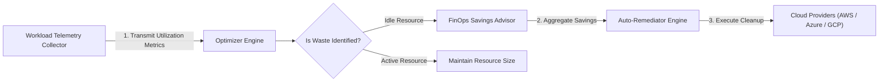

# Cloud Cost Optimizer Architecture

The **Cloud Cost Optimizer** is an automated multi-cloud rightsizing, idle resource cleanup, and cost remediation engine written in **pure Golang (Go v1.22+)**.

## Component Sequence Diagram

## Core Engine Modules

1. **Optimizer Engine (`internal/optimizer/engine.go`)**
   - Evaluates CPU and memory utilization thresholds to calculate estimated monthly savings.

2. **Savings Advisor (`internal/recommendation/advisor.go`)**
   - Aggregates potential cost savings into executive FinOps recommendations.

3. **Auto-Remediator (`internal/remediation/auto_remediator.go`)**
   - Executes dry-run or automated remediation policies to clean up idle resources.

4. **CLI Entrypoint (`main.go`)**
   - Command-line server entrypoint for running cost optimization audits.
